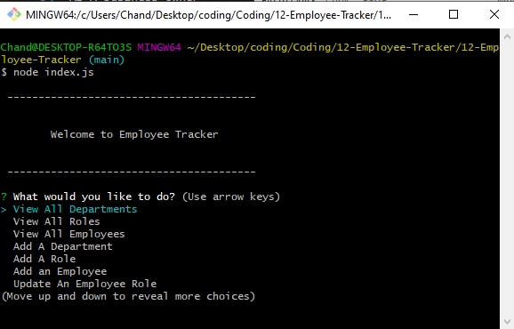

# Employee Tracker

An application that can view and manage departments, roles, and employees.

## User Story

```md
AS A business owner
I WANT to be able to view and manage the departments, roles, and employees in my company
SO THAT I can organize and plan my business
```

## Initial Setup

`npm install`

This application uses dotenv.

You must create an .env file with the following parameters

>DB_HOST=
>DB_USER=
>DB_PASS=
>DB_NAME=

There is a db/seeds.sql file for examples.

## How to use it 

Run `node index.js`



## Demostration

[Link](https://drive.google.com/file/d/1vmmFoWY-An2hmxEQCMxeSkUT0AFT3K2b/view?usp=sharing)

## License

MIT License

[license](./LICENSE)

## Future updates

Update folder that contains extra functionality to be further implemented into the application in the future

- Update employee manager
- View employees by manager
- View employees by department
- Delete departments, roles, and employees
- View the total utilized budget of a department